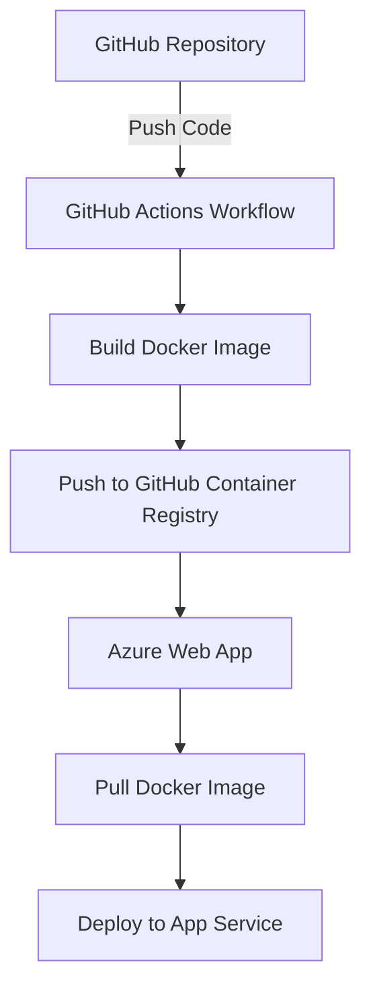

# 🚀 Azure Web App Deployment using GitHub Actions

This repository demonstrates a CI/CD workflow to deploy a Dockerized Spring Boot Java application to **Microsoft Azure App Service** using **GitHub Actions**.

🔗 **GitHub Repo**: [Celebal_Project](https://github.com/vanshtarar4/Celebal_Project)  
🎥 **Showcase Video**: [Google Drive Demo](<YOUR-GOOGLE-DRIVE-LINK-HERE>)  
🌐 **Live Web App**: [Celebal Pharma App](https://celebal-pharma-app-b0d3f5c5f5hhhngn.eastus-01.azurewebsites.net)

---

## 📘 Project Description

As part of my internship at **Celebal Technologies**, I implemented an automated CI/CD pipeline to streamline software deployment for a customer-facing web application of a fictional pharmaceutical company. The goal was to ensure faster, seamless updates using **Azure Web App** and **GitHub Actions**.

This project highlights:
- Containerization of a Spring Boot application
- Integration of GitHub Actions for CI/CD
- Deployment to Azure with automated workflows

---

## 🧩 Business Problem Statement

A leading pharmaceutical company needs a modern deployment strategy to:
- Regularly update their product-related content
- Provide reliable, scalable hosting
- Automate deployment using GitHub Actions and Azure services

---

## ✅ Prerequisites

- A valid **Azure account**
- Dockerized **Spring Boot Java application**
- GitHub repository with application source code

---

## 🏗️ High-Level Architecture



---

## 🔁 CI/CD Workflow

1. Create GitHub repo with Spring Boot Java app.
2. Set up Azure Web App service instance.
3. Create GitHub Actions workflow (YAML).
4. Configure automatic triggers on push.
5. Securely store secrets in GitHub.
6. Authenticate Azure and deploy Docker image.
7. Validate the deployed app.
8. Set up monitoring & logs in Azure.

---

## 📂 Tech Stack

- **Java 17**
- **Spring Boot**
- **Docker**
- **GitHub Actions**
- **Microsoft Azure App Service**

---

## 🛠️ How to Run Locally

```bash
# Clone the repo
git clone https://github.com/vanshtarar4/Celebal_Project.git
cd Celebal_Project

# Build Docker image
docker build -t celebal-app .

# Run Docker container
docker run -p 8080:8080 celebal-app
```

Access the application at `http://localhost:8080`

---

## 📎 Helpful References

- [Azure GitHub Actions Deployment Docs](https://learn.microsoft.com/en-us/azure/app-service/deploy-github-actions?tabs=applevel%2Caspnetcore)
- [Medium Article - Spring Boot + Azure](https://medium.com/@kharvinagaraj1/deploying-a-spring-boot-java-application-to-azure-app-service-using-github-actions-9d03405380bf)

---

## 👨‍💼 Author

**Vansh Tarar**  
Intern @ Celebal Technologies  
📧 vanshtarar4@gmail.com  
🔗 [LinkedIn](https://www.linkedin.com/in/vanshtarar/)

---


[← Back to Main](../README.md) | [Next Week →](../Week-3/README.md)
